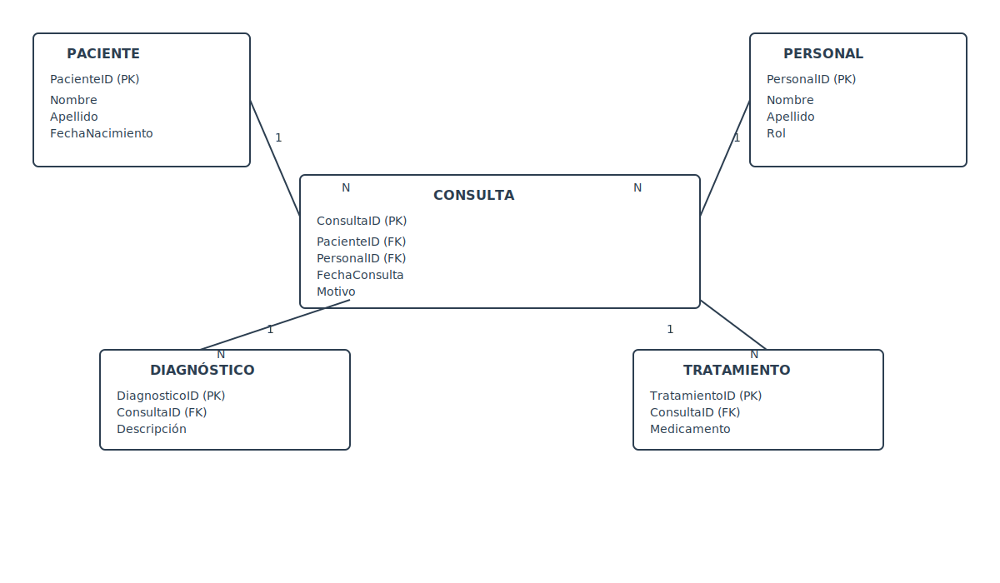

# Sistema de Historias Clínicas Electrónicas (HCE)

Método caso no. 3 basado en la unidad 6

## 📋 Descripción

Sistema de gestión de historias clínicas electrónicas desarrollado en SQL Server. Permite almacenar y administrar información de pacientes, consultas médicas, diagnósticos y tratamientos de forma integrada.

## 🗂️ Estructura del Proyecto

```
HCE/
├── SQL/
│   ├── Tablas/              # Definición de tablas base
│   ├── Funciones/           # Funciones SQL reutilizables
│   ├── Procedimientos/      # Procedimientos almacenados
│   ├── Vistas/              # Vistas de datos
│   ├── Datos de prueba/     # Scripts de inserción de datos
│   └── Comprobaciones/      # Scripts de prueba y validación
└── Docs/                    # Documentación

```

## 📊 Diagrama Entidad-Relación (ERD)


> Diagrama Entidad-Relación (ERD) en formato SVG. Muestra las entidades principales y sus relaciones (1:N) entre `Paciente`, `Personal`, `Consulta`, `Diagnóstico` y `Tratamiento`.

## 📊 Entidades Principales

### Tablas
- **Paciente**: Información demográfica de pacientes
- **Personal**: Datos del personal médico y administrativo
- **Consulta**: Registro de consultas médicas
- **Diagnóstico**: Diagnósticos asociados a consultas
- **Tratamiento**: Tratamientos prescritos

### Funciones SQL
- `CalcularEdad(@FechaNacimiento)`: Calcula la edad de un paciente
- `TotalConsultasPorPaciente(@PacienteID)`: Cuenta total de consultas de un paciente
- `UltimaConsultaPorPaciente(@PacienteID)`: Obtiene la fecha de última consulta

### Procedimientos Almacenados
- `RegistrarConsulta`: Registra una nueva consulta médica
- `ConsultasPorFecha`: Obtiene consultas de una fecha específica
- `ResumenPaciente`: Genera historial clínico completo de un paciente

### Vistas
- `VistaResumenConsultas`: Resumen general de todas las consultas
- `VistaConsultasPorPersonal`: Consultas agrupadas por personal
- `VistaHistorialPaciente`: Historial completo del paciente

## 🔧 Uso

### Insertar Datos de Prueba
```sql
-- Ejecutar scripts desde SQL/Datos de prueba/
INSERT INTO Paciente (PacienteID, Nombre, Apellido, FechaNacimiento, Sexo, Email)
VALUES (1, 'Ana', 'Gómez', '1990-05-12', 'Femenino', 'ana.gomez@example.com');
```

### Registrar una Consulta
```sql
EXEC RegistrarConsulta 
  @PacienteID = 1, 
  @PersonalID = 1, 
  @FechaConsulta = '2025-11-14', 
  @Motivo = 'Control de presión arterial';
```

### Consultar Datos
```sql
-- Obtener historial de un paciente
EXEC ResumenPaciente @PacienteID = 1;

-- Ver consultas por fecha
EXEC ConsultasPorFecha @Fecha = '2025-11-14';

-- Ver resumen general
SELECT * FROM VistaResumenConsultas;
```

## 📁 Contenidos por Carpeta

### SQL/Tablas
Definición de estructura de base de datos con relaciones y restricciones

### SQL/Funciones
Funciones personalizadas para cálculos y transformaciones de datos

### SQL/Procedimientos
Procedimientos almacenados para operaciones complejas del negocio

### SQL/Vistas
Vistas predefinidas para consultas frecuentes

### SQL/Datos de prueba
Inserciones de datos de ejemplo para pruebas del sistema

### SQL/Comprobaciones
Scripts de validación y prueba de funciones y procedimientos

## 🎯 Características

- ✅ Gestión completa de pacientes
- ✅ Registro de consultas y diagnósticos
- ✅ Historial clínico por paciente
- ✅ Funciones de cálculo automático
- ✅ Vistas integradas para reportes
- ✅ Procedimientos para operaciones complejas

## 📝 Notas

Este proyecto es un caso de estudio basado en la unidad 6 del plan de formación.
